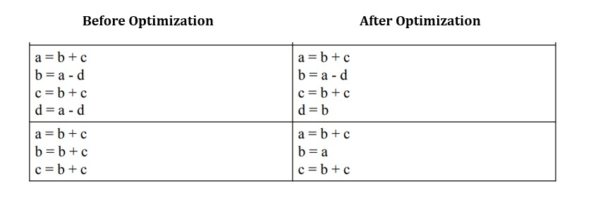
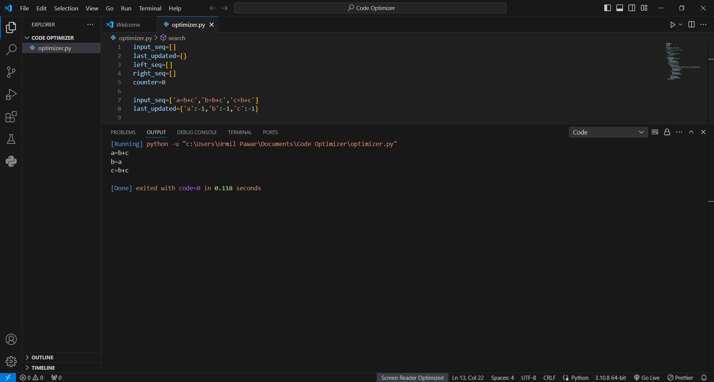
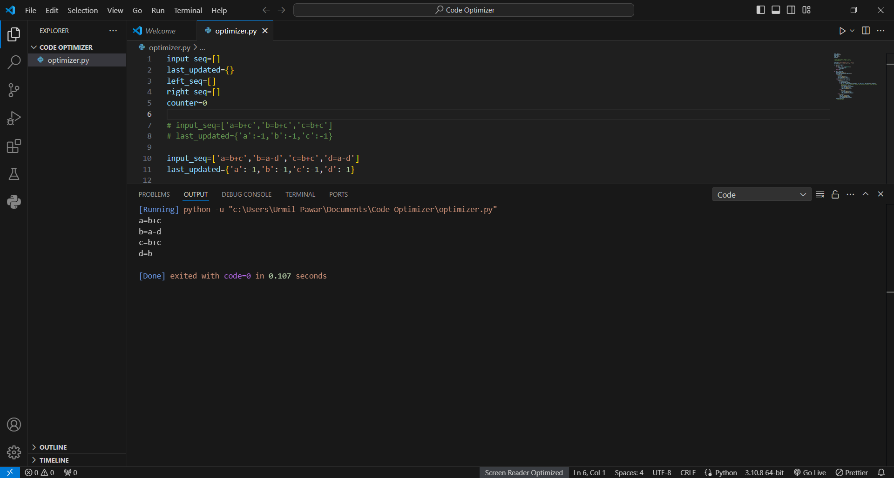

The project involves building a 3ACF code optimizer that optimizes given Three Address Code by eliminating common subexpressions.
- The code checks if any of the variables in the right hand side expression is updated after the same expression has been assigned to a specific variable earlier
- If updated then no changes are done otherwise the specific varible to which expression was assigned earlier is substituted to the right hand side

## Images
Following is the optimization which is to be acheived

- Case 1

- Case 2

